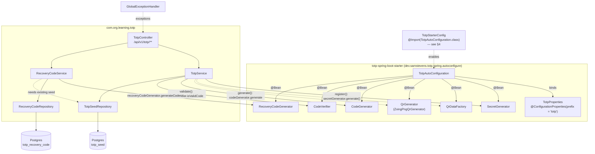
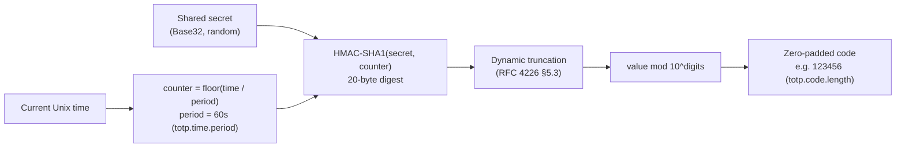
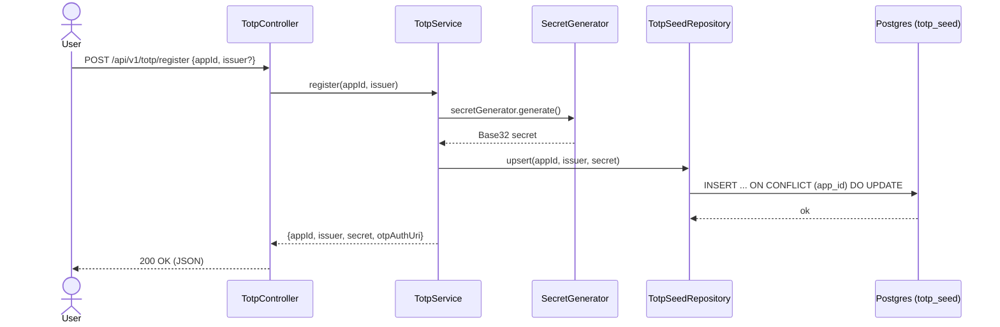
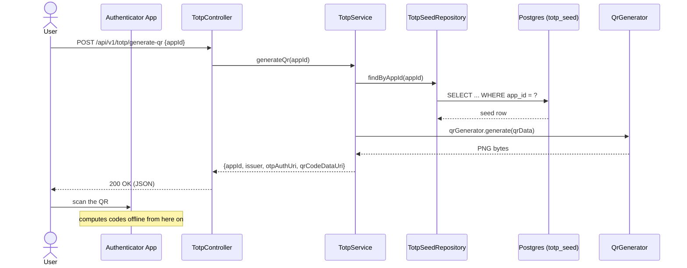
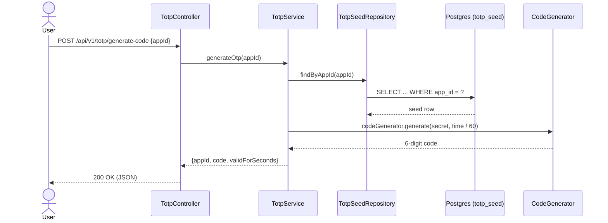
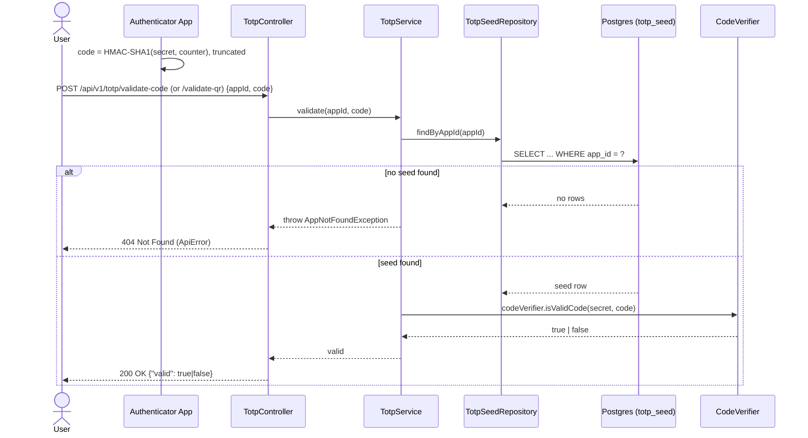
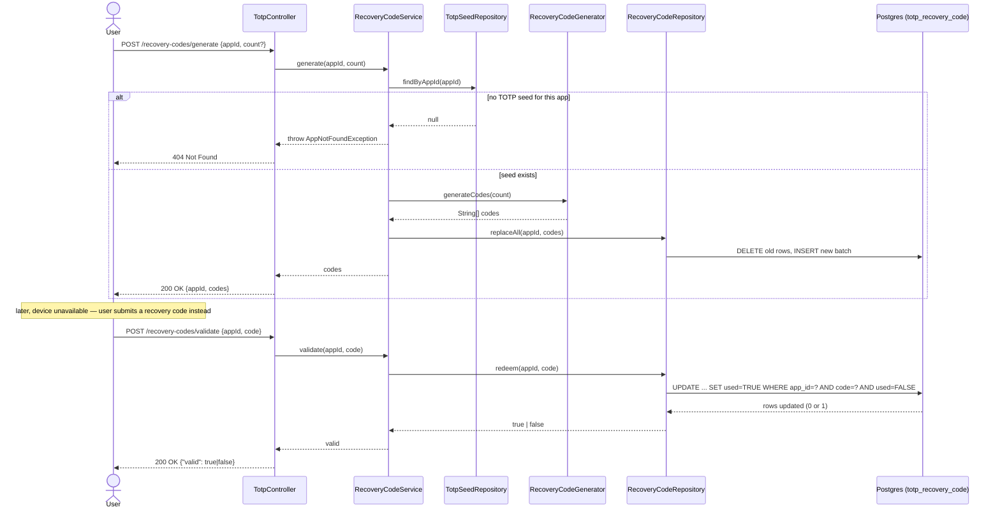

# learning-totp


Six REST APIs — **register** an app, **generate-qr**/**generate** a TOTP code two ways,
**validate-qr**/**validate** it, and **generate**/**validate** one-time recovery codes — built
entirely on beans that
[`totp-spring-boot-starter`](https://github.com/samdjstevens/java-totp/blob/master/totp-spring-boot-starter/README.md)
auto-configures for [`dev.samstevens.totp`](https://github.com/samdjstevens/java-totp), with the
secret and recovery codes persisted in Postgres via Flyway-managed migrations.

This is deliberately narrower in scope than its sibling
[`learning-utility`](../learning-utility), which wires the plain `dev.samstevens.totp:totp`
library **by hand** (`new DefaultSecretGenerator()`, `new DefaultCodeVerifier(...)`, etc.) and
additionally encrypts the secret at rest. This project injects every TOTP collaborator
(`SecretGenerator`, `QrDataFactory`, `QrGenerator`, `CodeGenerator`, `CodeVerifier`,
`RecoveryCodeGenerator`) as a Spring bean the starter builds for you from `application.yaml`
properties — no manual `new Default...()` wiring. The trade-off, and a genuine gotcha this README
documents in detail, is that the starter needed one line of help to even auto-configure on a
modern Spring Boot version — see
[§4](#4-the-gotcha-the-starter-doesnt-auto-configure-out-of-the-box).

---

## Table of contents

1. 🧰 [Tech stack](#1-tech-stack)
2. 🏗️ [Architecture](#2-architecture)
3. 🚀 [How the starter auto-configures TOTP](#3-how-the-starter-auto-configures-totp)
4. ⚠️ [The gotcha: the starter doesn't auto-configure out of the box](#4-the-gotcha-the-starter-doesnt-auto-configure-out-of-the-box)
5. 💡 [How TOTP actually works](#5-how-totp-actually-works)
6. 🔐 [Why registration is a separate step](#6-why-registration-is-a-separate-step)
7. 🔑 [Recovery codes](#7-recovery-codes)
8. 🔹 [Sequence diagrams](#8-sequence-diagrams)
9. 📚 [API reference](#9-api-reference)
10. 🗄️ [Data model](#10-data-model)
11. ⚙️ [Configuration reference](#11-configuration-reference)
12. 🤖 [Project structure](#12-project-structure)
13. ⚠️ [Error handling](#13-error-handling)
14. 🚀 [Running](#14-running)
15. 🧪 [Testing](#15-testing)

---

<a id="1-tech-stack"></a>
## 1. 🧰 Tech stack

| Concern      | Technology                                                                          |
|--------------|--------------------------------------------------------------------------------------|
| Language     | Java 25                                                                               |
| Framework    | Spring Boot 4.1.0, Spring MVC                                                        |
| TOTP         | `dev.samstevens.totp:totp-spring-boot-starter` 1.7.1 (auto-configures the core `totp` library) |
| QR rendering | ZXing (pulled in transitively by `totp`, used internally by its `ZxingPngQrGenerator`) |
| Persistence  | Spring JDBC (`JdbcTemplate`) + PostgreSQL + Flyway                                    |
| API docs     | springdoc-openapi (Swagger UI)                                                       |
| Testing      | JUnit 5, Testcontainers (real Postgres, no mocks)                                    |
| Build        | Maven — parent `com.org.llm:super-pom`; dependency versions from `com.org.learning:learning-bom` (no version is hardcoded in this module's `pom.xml`) |

---

<a id="2-architecture"></a>
## 2. 🏗️ Architecture



`TotpService`/`RecoveryCodeService` never call `new DefaultSecretGenerator()` or any other
`Default*` class — every TOTP collaborator arrives via constructor injection, sourced entirely
from the starter's auto-configuration. Persistence (`TotpSeedRepository`/`RecoveryCodeRepository`)
is plain hand-written `JdbcTemplate`, unrelated to the starter.

Enrollment and code retrieval are split into distinct endpoints so each collaborator bean is
exercised on its own: `register` only touches `SecretGenerator`, `generate-qr` only touches
`QrDataFactory`/`QrGenerator`, and `generate` only touches `CodeGenerator` — all three read the
same persisted secret rather than each minting their own.

---

<a id="3-how-the-starter-auto-configures-totp"></a>
## 3. 🚀 How the starter auto-configures TOTP

[`TotpAutoConfiguration`](https://github.com/samdjstevens/java-totp/blob/master/totp-spring-boot-starter/src/main/java/dev/samstevens/totp/spring/autoconfigure/TotpAutoConfiguration.java)
is an ordinary `@Configuration` class, gated by `@ConditionalOnClass(TotpInfo.class)` (i.e. it
only activates when the core `totp` jar — a transitive dependency of the starter — is on the
classpath) and bound to `@ConfigurationProperties(prefix = "totp")`
([`TotpProperties`](https://github.com/samdjstevens/java-totp/blob/master/totp-spring-boot-starter/src/main/java/dev/samstevens/totp/spring/autoconfigure/TotpProperties.java)).
It declares seven `@Bean` methods, every one `@ConditionalOnMissingBean` so any bean you define
yourself silently overrides it:

| Bean               | Default implementation                          | Reads from `TotpProperties`                  |
|--------------------|--------------------------------------------------|------------------------------------------------|
| `SecretGenerator`  | `new DefaultSecretGenerator(secretLength)`        | `totp.secret.length` (default `32`)             |
| `HashingAlgorithm`  | `HashingAlgorithm.SHA1`                          | — (override by defining your own bean)          |
| `QrDataFactory`     | `new QrDataFactory(hashingAlgorithm, codeLength, timePeriod)` | `totp.code.length`, `totp.time.period` |
| `QrGenerator`       | `new ZxingPngQrGenerator()`                      | —                                                |
| `CodeGenerator`     | `new DefaultCodeGenerator(algorithm, codeLength)` | `totp.code.length` (default `6`)                |
| `CodeVerifier`      | `new DefaultCodeVerifier(codeGenerator, timeProvider)`, `setTimePeriod`/`setAllowedTimePeriodDiscrepancy` applied | `totp.time.period` (default `30`, **`60` in this project's `application.yaml`**), `totp.time.discrepancy` (default `1`) |
| `TimeProvider`      | `new SystemTimeProvider()`                       | —                                                |
| `RecoveryCodeGenerator` | `new RecoveryCodeGenerator()`                | — (used by [§7](#7-recovery-codes))              |

`TotpService` injects `SecretGenerator`, `QrDataFactory`, `QrGenerator`, `CodeGenerator` and
`CodeVerifier`; `RecoveryCodeService` injects `RecoveryCodeGenerator`. Every value in
[§11](#11-configuration-reference) is a `totp.*` property that `TotpProperties` binds and hands to
these bean factory methods — change `totp.code.length: 8` in `application.yaml` and `QrDataFactory`,
`CodeGenerator` and `CodeVerifier` all pick up 8-digit codes automatically, with no code change.
Likewise `totp.time.period` drives both `CodeVerifier`'s acceptance window and the counter this
project's `TotpService.generateOtp()` computes by hand (`time / timePeriod`) — see
[§9](#9-api-reference).

---

<a id="4-the-gotcha-the-starter-doesnt-auto-configure-out-of-the-box"></a>
## 4. ⚠️ The gotcha: the starter doesn't auto-configure out of the box

`totp-spring-boot-starter` 1.7.1 — the latest version on Maven Central, last published
2020-11-05 — registers `TotpAutoConfiguration` **exclusively** via the legacy
`META-INF/spring.factories` mechanism:

```
org.springframework.boot.autoconfigure.EnableAutoConfiguration=\
dev.samstevens.totp.spring.autoconfigure.TotpAutoConfiguration
```

Spring Boot 3.0 dropped support for auto-configuration entries in `spring.factories` — since then,
only `META-INF/spring/org.springframework.boot.autoconfigure.AutoConfiguration.imports` is
scanned. The starter jar has no such file. The practical effect on Spring Boot 4.1 (this
project's version, same story on any Boot 3+ version): **add the starter dependency alone, and
none of its beans exist.** `SecretGenerator`, `CodeVerifier` and friends are simply absent from
the context — `TotpService`'s constructor injection fails at startup with
`NoSuchBeanDefinitionException`, which is exactly what happened building this repo before the fix
below was added (verified directly — `mvn verify` failed with that exact exception until this
class existed).

The fix, [`TotpStarterConfig`](src/main/java/com/org/learning/totp/config/TotpStarterConfig.java),
is three lines:

```java
@Configuration
@Import(TotpAutoConfiguration.class)
public class TotpStarterConfig {}
```

`TotpAutoConfiguration` is a perfectly normal `@Configuration` class once you're inside the jar —
the only thing missing is the metadata file that would make Spring Boot import it *automatically*.
`@Import` registers it explicitly, which also re-triggers its
`@EnableConfigurationProperties(TotpProperties.class)`, so `totp.*` properties bind exactly as
they would if auto-configuration had picked the class up on its own. No forking or shading of the
starter jar required — this is a three-line workaround, not a maintenance burden.

**This is not a criticism of this project's approach — it's the actual state of the upstream
library.** If you use `totp-spring-boot-starter` with Spring Boot 3 or newer, you need this same
`@Import`, or an equivalent `spring.factories`-to-`AutoConfiguration.imports` shim in your own
`META-INF`. It's also *why* `learning-utility` doesn't use the starter at all and wires the plain
`totp` core library by hand instead — both are valid ways to use this library on a modern Spring
Boot version; this repo exists specifically to show the starter path (and its one caveat) working.

---

<a id="5-how-totp-actually-works"></a>
## 5. 💡 How TOTP actually works

TOTP ([RFC 6238](https://datatracker.ietf.org/doc/html/rfc6238)) is the algorithm behind the
6-digit codes in Google Authenticator, Authy, and similar apps. It's HOTP
([RFC 4226](https://datatracker.ietf.org/doc/html/rfc4226)) with the counter replaced by time:



1. **Shared secret** — `secretGenerator.generate()` produces a random Base32 string (32 characters
   by default, `totp.secret.length`). Base32 is what the `otpauth://` URI format expects, and it's
   human-typeable if QR scanning isn't available.
2. **Time step** — instead of an incrementing counter, the counter is derived from wall-clock time
   (`floor(unix_time / period)`), so server and phone independently compute the same value with no
   round trip. This project sets `totp.time.period: 60`, so **each code is valid for a full 60
   seconds** rather than the library's 30-second default — see [§11](#11-configuration-reference).
3. **HMAC-SHA1** — the 8-byte counter is HMAC'd with the secret. SHA1 remains the de facto
   interoperability standard for TOTP (used purely as a keyed PRF here, not for collision
   resistance) — nearly every authenticator app assumes it by default.
4. **Dynamic truncation + modulo** — the 20-byte digest is truncated to 4 bytes per RFC 4226 §5.3,
   then reduced `mod 10^digits` and zero-padded to the configured code length.

**Clock drift tolerance:** `codeVerifier.isValidCode(secret, code)` doesn't just check the current
time step — it also checks `totp.time.discrepancy` steps before/after (default `1`), so a code is
accepted for roughly the surrounding ±60 seconds on top of its own 60-second window. Too narrow and
minor clock skew rejects legitimate users; too wide and you extend an attacker's replay window if a
code is intercepted.

---

<a id="6-why-registration-is-a-separate-step"></a>
## 6. 🔐 Why registration is a separate step

An earlier version of this project generated a secret and rendered its QR code in the same call
that enrolled the device. That's fine for demonstrating the starter's beans in isolation, but it
conflates three independent concerns — minting a secret, showing it as a QR code, and reading the
current numeric code — that a real client needs to call separately (enroll once, then repeatedly
ask "what's the code right now?"). This project now splits them:

- **Registration** (`POST /register`) persists the secret against `appId` — `upsert()` is an
  `INSERT ... ON CONFLICT (app_id) DO UPDATE`, so calling `/register` again for an app id that
  already has a seed **rotates the secret**, invalidating whatever was scanned into an
  authenticator app before. This mirrors real "reset my 2FA for this app" flows, which are also
  destructive by nature.
- **`appId`, not `deviceId`** — a physical device can host more than one install (or version) of
  an MFA app, each needing its own secret, so the enrollment key names the *app install*, not the
  device it happens to run on. `totp_seed`/`totp_recovery_code` are keyed by `app_id` (see
  [§10](#10-data-model), migrated from `device_id` by `V3__rename_device_id_to_app_id.sql`).
- **`/generate-qr` and `/generate-code`** both require an existing registration — they look the secret
  up (`TotpSeedRepository.findByAppId`) rather than minting a new one, and throw
  `AppNotFoundException` (→ 404) if `/register` was never called for that `appId`.
- **Validation** (`POST /validate-code` and `POST /validate-qr` — identical logic, kept as two routes
  since which enrollment path a client used doesn't change how a code is checked) takes only
  `appId` and `code` — the secret never travels in the request at all.

**What this still doesn't do**, to be explicit about scope: the secret column is stored as-is, not
encrypted at rest (unlike `learning-utility`'s `TotpSecretCipher`, AES-256-GCM), and there's no
authentication gate on any endpoint — anyone who knows an `appId` can validate against it or
trigger a rotation. Both are real gaps for a production deployment; they're out of scope here
because the focus of this repo is the starter's auto-configuration and the persistence model, not
re-implementing `learning-utility`'s security hardening a second time.

---

<a id="7-recovery-codes"></a>
## 7. 🔑 Recovery codes

The starter also auto-configures a `RecoveryCodeGenerator` bean
([§3](#3-how-the-starter-auto-configures-totp)) — a fallback path into an account when the user's
device (and its TOTP app) is unavailable. `RecoveryCodeService` wires it up:

```java
String[] codes = recoveryCodeGenerator.generateCodes(count); // e.g. "tf8i-exmo-3lcb-slkm"
```

Each code is 16 characters — digits and lowercase Latin letters, dash-grouped for readability — for
roughly 82 bits of entropy per the library's own documentation. Two rules this project enforces
around them:

- **Requires an existing registration.** `POST /recovery-codes/generate` throws
  `AppNotFoundException` (→ 404) unless `/register` has already been called for that `appId` —
  recovery codes are a fallback *for* an enrolled TOTP secret, not a standalone credential.
- **Regenerating replaces the batch.** `RecoveryCodeRepository.replaceAll()` deletes every code
  previously issued for the app before inserting the new batch (in a single method, not two
  separate calls a client could interleave with a redeem) — old codes stop working the moment new
  ones are issued, same rotation semantics as the TOTP secret itself.
- **Each code works exactly once.** `POST /recovery-codes/validate` calls
  `RecoveryCodeRepository.redeem()`, which is one atomic SQL statement:

  ```sql
  UPDATE totp_recovery_code SET used = TRUE, used_at = NOW()
  WHERE app_id = ? AND code = ? AND used = FALSE
  ```

  The row only flips if it exists **and** is still unused, and the returned row-count (0 or 1) is
  the whole result — no separate read-then-write, so two concurrent redemption attempts with the
  same code can't both succeed. A wrong code, an already-used code, and an unknown app all
  return `{"valid": false}` with the same 200 response, deliberately — distinguishing them in the
  response would let an attacker probe which codes are real.

Like the TOTP secret, codes are stored as plain text in `totp_recovery_code`, not hashed — see the
scope note at the end of [§6](#6-why-registration-is-a-separate-step); the same trade-off applies
here.

---

<a id="8-sequence-diagrams"></a>
## 8. 🔹 Sequence diagrams

### Registration — generate and persist a secret



### `/generate-qr` — render the enrollment QR code for an already-registered app



### `/generate-code` — read the current numeric code for an already-registered app



### `/validate-code` and `/validate-qr` — server looks the secret up itself



### Recovery codes — issue a batch, then redeem one



An `otpauth://` QR generated by this app (scan it with any authenticator to see it work):


---

<a id="9-api-reference"></a>
## 9. 📚 API reference

Swagger UI: `http://localhost:8096/swagger-ui.html` — an interactive form for all six endpoints
below, generated from the springdoc `@Operation`/`@Schema` annotations on
[`TotpController`](src/main/java/com/org/learning/totp/controller/TotpController.java) and the
DTOs.

### `POST /api/v1/totp/register` — create/rotate an app's secret

```bash
curl -s -X POST http://localhost:8096/api/v1/totp/register \
  -H "Content-Type: application/json" \
  -d '{"appId": "alice-iphone-15-authenticator-v2"}'
```

```json
{
  "appId": "alice-iphone-15-authenticator-v2",
  "issuer": "learning-totp",
  "secret": "JBSWY3DPEHPK3PXP",
  "otpAuthUri": "otpauth://totp/learning-totp:alice-iphone-15-authenticator-v2?secret=JBSWY3DPEHPK3PXP&issuer=learning-totp&algorithm=SHA1&digits=6&period=60"
}
```

`issuer` is optional (defaults to `learning-totp`). The secret is persisted against `appId` —
calling this again for the same app id **rotates** it. `400` (`ApiError`) if `appId` is blank.

### `POST /api/v1/totp/generate-qr` — enrollment QR code for an already-registered app

```bash
curl -s -X POST http://localhost:8096/api/v1/totp/generate-qr \
  -H "Content-Type: application/json" \
  -d '{"appId": "alice-iphone-15-authenticator-v2"}'
```

```json
{
  "appId": "alice-iphone-15-authenticator-v2",
  "issuer": "learning-totp",
  "otpAuthUri": "otpauth://totp/learning-totp:alice-iphone-15-authenticator-v2?secret=JBSWY3DPEHPK3PXP&issuer=learning-totp&algorithm=SHA1&digits=6&period=60",
  "qrCodeDataUri": "data:image/png;base64,iVBORw0KGgoAAAANSUhEUgAA..."
}
```

`qrCodeDataUri` can be dropped straight into an `` tag. `404` (`ApiError`) if
`/register` was never called for `appId`.

### `POST /api/v1/totp/generate-code` — the current numeric code for an already-registered app

```bash
curl -s -X POST http://localhost:8096/api/v1/totp/generate-code \
  -H "Content-Type: application/json" \
  -d '{"appId": "alice-iphone-15-authenticator-v2"}'
```

```json
{ "appId": "alice-iphone-15-authenticator-v2", "code": "482913", "validForSeconds": 42 }
```

`code` is the code for the *current* time step, computed via the auto-configured `CodeGenerator` —
the same value an enrolled authenticator app would be showing right now. `validForSeconds` counts
down to `0` as the 60-second window (`totp.time.period`) elapses, then a new code takes over.
`404` (`ApiError`) if `/register` was never called for `appId`.

### `POST /api/v1/totp/validate-qr` — check a code from an app enrolled via `/generate-qr`

```bash
curl -s -X POST http://localhost:8096/api/v1/totp/validate-qr \
  -H "Content-Type: application/json" \
  -d '{"appId": "alice-iphone-15-authenticator-v2", "code": "123456"}'
```

```json
{ "valid": true }
```

### `POST /api/v1/totp/validate-code` — check a code against the saved secret for an app

```bash
curl -s -X POST http://localhost:8096/api/v1/totp/validate-code \
  -H "Content-Type: application/json" \
  -d '{"appId": "alice-iphone-15-authenticator-v2", "code": "123456"}'
```

```json
{ "valid": true }
```

`/validate-code` and `/validate-qr` run the exact same check — separate routes, identical logic, since
validation doesn't depend on how the app was enrolled. A wrong code is `200 { "valid": false }`,
not an error. `404` (`ApiError`) if `/register` was never called for `appId`. `400` if
`appId`/`code` is blank or `code` isn't numeric.

### `POST /api/v1/totp/recovery-codes/generate` — issue one-time backup codes

```bash
curl -s -X POST http://localhost:8096/api/v1/totp/recovery-codes/generate \
  -H "Content-Type: application/json" \
  -d '{"appId": "alice-iphone-15-authenticator-v2", "count": 10}'
```

```json
{
  "appId": "alice-iphone-15-authenticator-v2",
  "codes": ["tf8i-exmo-3lcb-slkm", "boyv-yq75-z99k-r308", "..."]
}
```

`count` is optional (default `10`, max `20`). Requires an existing TOTP secret for `appId` —
`404` (`ApiError`) otherwise. Calling this again **replaces** the previous batch — codes are
returned once and never retrievable again.

### `POST /api/v1/totp/recovery-codes/validate` — redeem a recovery code

```bash
curl -s -X POST http://localhost:8096/api/v1/totp/recovery-codes/validate \
  -H "Content-Type: application/json" \
  -d '{"appId": "alice-iphone-15-authenticator-v2", "code": "tf8i-exmo-3lcb-slkm"}'
```

```json
{ "valid": true }
```

`valid` is `true` only the *first* time a given code is submitted — a second attempt with the same
code, a wrong code, or an unknown app all return `{"valid": false}`, `200`, indistinguishably.

An Insomnia collection covering all six endpoints is at `insomnia-collection.json`.

---

<a id="10-data-model"></a>
## 10. 🗄️ Data model

Two tables, migrated by Flyway on startup (`src/main/resources/db/migration/`), originally created
keyed by `device_id` (`V1`/`V2`) and renamed to `app_id` by `V3` — see [§6](#6-why-registration-is-a-separate-step)
for why:

**`totp_seed`** (`V1__create_totp_seed.sql`, renamed by `V3`) — one row per registered app install:

| Column       | Type           | Notes                                     |
|--------------|----------------|--------------------------------------------|
| `id`         | `BIGSERIAL`    | primary key                                |
| `app_id`     | `VARCHAR(100)` | `NOT NULL UNIQUE`                          |
| `issuer`     | `VARCHAR(100)` | `NOT NULL`                                 |
| `secret`     | `VARCHAR(64)`  | `NOT NULL` — Base32, stored as-is          |
| `created_at` | `TIMESTAMPTZ`  | `NOT NULL DEFAULT NOW()`, refreshed on rotation |

**`totp_recovery_code`** (`V2__create_totp_recovery_code.sql`, renamed by `V3`) — many rows per app:

| Column       | Type           | Notes                                              |
|--------------|----------------|------------------------------------------------------|
| `id`         | `BIGSERIAL`    | primary key                                          |
| `app_id`     | `VARCHAR(100)` | `NOT NULL`, `REFERENCES totp_seed (app_id) ON DELETE CASCADE` |
| `code`       | `VARCHAR(32)`  | `NOT NULL`, unique per `(app_id, code)`              |
| `used`       | `BOOLEAN`      | `NOT NULL DEFAULT FALSE`                             |
| `used_at`    | `TIMESTAMPTZ`  | set by `redeem()` when a code is spent               |
| `created_at` | `TIMESTAMPTZ`  | `NOT NULL DEFAULT NOW()`                             |

`ON DELETE CASCADE` means an app's recovery codes are removed automatically if its `totp_seed`
row is ever deleted directly — there's no code path that does that today (`/register` upserts, it
never deletes), but the constraint keeps the two tables consistent if one is added later.

---

<a id="11-configuration-reference"></a>
## 11. ⚙️ Configuration reference

All `totp.*` properties are bound by the starter's own `TotpProperties`
(`@ConfigurationProperties(prefix = "totp")`) — see [§3](#3-how-the-starter-auto-configures-totp)
for exactly which bean each one feeds.

| Property                 | Meaning                                    | Library default  | This project     |
|----------------------------|---------------------------------------------|-------------------|-------------------|
| `totp.secret.length`       | Characters in a newly generated secret       | `32`              | `32`              |
| `totp.code.length`         | Digits in a generated/validated code         | `6`               | `6`               |
| `totp.time.period`         | Seconds per time step                        | `30`              | **`60`** — each code stays valid for a full minute |
| `totp.time.discrepancy`    | +/- time steps tolerated during validation   | `1`               | `1`               |
| `server.port`              | —                                             | —                | `8096`            |
| `spring.datasource.url`    | via `POSTGRES_HOST`/`POSTGRES_PORT`/`POSTGRES_DB` | —           | `jdbc:postgresql://localhost:5433/totp` |
| `spring.datasource.username` | via `POSTGRES_USER`                        | —                | `totp`            |
| `spring.datasource.password` | via `POSTGRES_PASSWORD`                    | —                | `totp`            |

Changing the hashing algorithm or time source isn't a property — the starter expects a bean
override instead (see `TotpAutoConfiguration`'s `@ConditionalOnMissingBean` methods in
[§3](#3-how-the-starter-auto-configures-totp)):

```java
@Bean
public HashingAlgorithm hashingAlgorithm() {
    return HashingAlgorithm.SHA256; // overrides the starter's SHA1 default
}

@Bean
public TimeProvider timeProvider() {
    return new NtpTimeProvider("pool.ntp.org"); // overrides SystemTimeProvider
}
```

Define either bean anywhere in this application's context (e.g. alongside `TotpStarterConfig`) and
`@ConditionalOnMissingBean` means the starter backs off automatically — no property to flip.

---

<a id="12-project-structure"></a>
## 12. 🤖 Project structure

```
src/main/java/com/org/learning/totp/
  LearningTotpApplication.java

  config/
    TotpStarterConfig.java             @Import(TotpAutoConfiguration.class) — see §4

  domain/
    TotpSeed.java                      persisted row: appId, issuer, secret, createdAt

  repository/
    TotpSeedRepository.java            upsert() / findByAppId()
    RecoveryCodeRepository.java        replaceAll() / redeem()

  service/
    TotpService.java                   register() / generateQr() / generateOtp() / validate()
    RecoveryCodeService.java           generate() / validate() — requires an existing seed

  controller/
    TotpController.java                POST /api/v1/totp/{register,generate-qr,generate-code,validate-qr,validate-code,recovery-codes/generate,recovery-codes/validate}
    GlobalExceptionHandler.java        maps exceptions to ApiError

  dto/
    RegisterDeviceRequest.java / RegisterDeviceResponse.java
    AppIdRequest.java / GenerateQrResponse.java / GenerateOtpResponse.java
    ValidateTotpRequest.java / ValidateTotpResponse.java
    GenerateRecoveryCodesRequest.java / GenerateRecoveryCodesResponse.java
    ValidateRecoveryCodeRequest.java / ValidateRecoveryCodeResponse.java
    ApiError.java

  exception/
    QrCodeRenderException.java         wraps the checked QrGenerationException
    OtpGenerationException.java        wraps the checked CodeGenerationException
    AppNotFoundException.java          -> 404

src/main/resources/
  application.yaml                     datasource, totp.*, springdoc.*
  db/migration/
    V1__create_totp_seed.sql
    V2__create_totp_recovery_code.sql
    V3__rename_device_id_to_app_id.sql

src/test/java/com/org/learning/totp/
  LearningTotpApplicationTests.java    Testcontainers-backed context load
  controller/TotpControllerTest.java   full-context test — no mocks, real starter beans + real Postgres
  repository/TotpSeedRepositoryTest.java

docker-compose.yml                     Postgres 19beta1 (same version as the other learning-* repos)
```

---

<a id="13-error-handling"></a>
## 13. ⚠️ Error handling

[`GlobalExceptionHandler`](src/main/java/com/org/learning/totp/controller/GlobalExceptionHandler.java)
maps every exception escaping `TotpController` to a shared `ApiError` JSON shape (`timestamp`,
`status`, `error`, `message`):

| Exception                          | HTTP status                        |
|-------------------------------------|-------------------------------------|
| `MethodArgumentNotValidException`   | 400 Bad Request                     |
| `AppNotFoundException`              | 404 Not Found                       |
| `QrCodeRenderException`             | 500 Internal Server Error (logged)  |
| `OtpGenerationException`            | 500 Internal Server Error (logged)  |
| anything else                       | 500 Internal Server Error (logged)  |

---

<a id="14-running"></a>
## 14. 🚀 Running

```bash
# 1. Start Postgres (same postgres:19beta1 image the other learning-* repos use)
docker compose up -d

# 2. Run the application — Flyway migrates totp_seed / totp_recovery_code automatically
./mvnw spring-boot:run
```

Swagger UI: `http://localhost:8096/swagger-ui.html`

---

<a id="15-testing"></a>
## 15. 🧪 Testing

```bash
./mvnw test
```

Every test in this project runs against a real Postgres via Testcontainers (`postgres:16-alpine`)
— nothing is mocked, so these are the tests that actually prove
[§4](#4-the-gotcha-the-starter-doesnt-auto-configure-out-of-the-box)'s fix and the persistence
layer both work, not just that the code compiles. Requires a running Docker daemon.

[`TotpControllerTest`](src/test/java/com/org/learning/totp/controller/TotpControllerTest.java):

- `registerReturnsASecretAndAnOtpAuthUri` — asserts the secret matches a 32-char Base32 pattern.
- `generateQrForARegisteredAppReturnsAScannableQrCode` / `generateQrForAnUnregisteredAppReturns404`
  — `/generate-qr`/`/generate-code` require a prior `/register`.
- `generateReturnsTheCurrentNumericCodeAndItValidatesSuccessfully` — registers an app,
  independently recomputes the current code via the auto-configured `CodeGenerator`/`TimeProvider`
  beans, asserts `/generate-code` returns that exact code, and that `/validate-code` accepts it.
- `validateQrAndValidateAgreeOnTheSameCode` — both validate routes accept the same current code.
- `validateWithAWrongCodeReturnsFalseNotAnError` / `validateForAnUnregisteredAppReturns404` /
  `registerWithABlankAppIdReturns400` — the non-happy paths.
- `recoveryCodesCanBeGeneratedAndEachRedeemedExactlyOnce` — generates a batch, redeems the first
  code successfully, then asserts the *same* code fails the second time.
- `generatingRecoveryCodesForAnUnregisteredAppReturns404` — the app-must-exist-first rule.

[`TotpSeedRepositoryTest`](src/test/java/com/org/learning/totp/repository/TotpSeedRepositoryTest.java)
tests the JDBC layer in isolation (no web layer): upsert-then-find round trip, secret rotation on
conflict, and `null` (not an exception) for a missing app.
