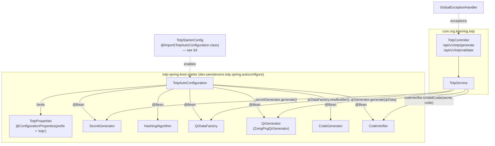
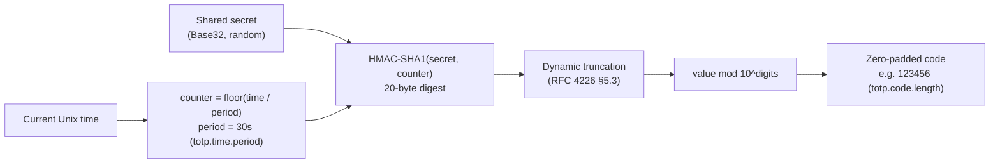
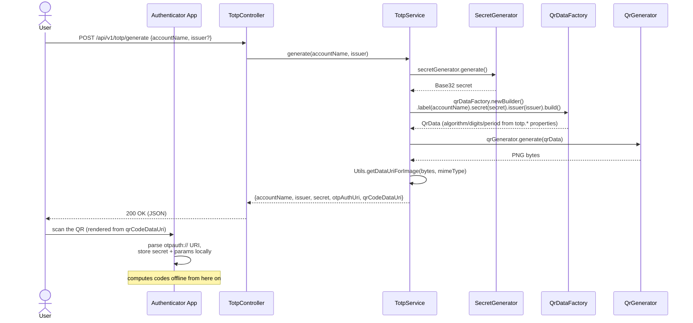
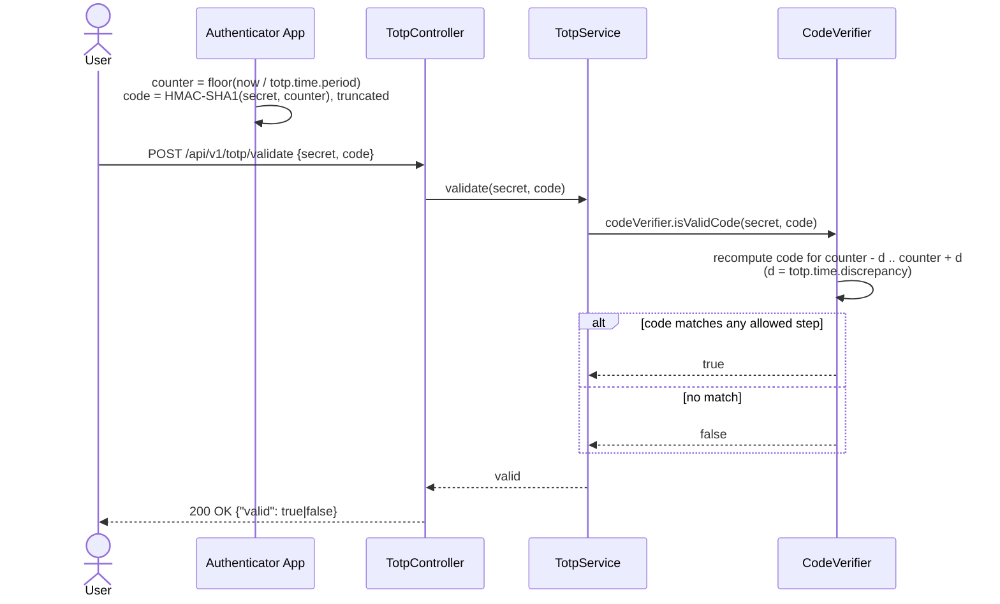

# learning-totp


Two REST APIs — **generate** and **validate** — for RFC 6238 time-based one-time passwords
(TOTP), built entirely on beans that
[`totp-spring-boot-starter`](https://github.com/samdjstevens/java-totp/blob/master/totp-spring-boot-starter/README.md)
auto-configures for [`dev.samstevens.totp`](https://github.com/samdjstevens/java-totp).

This is deliberately narrower in scope than its sibling
[`learning-utility`](../learning-utility), which wires the plain `dev.samstevens.totp:totp`
library **by hand** (`new DefaultSecretGenerator()`, `new DefaultCodeVerifier(...)`, etc.) and
persists secrets in Postgres. This project does neither: no persistence, no manual `new
Default...()` wiring — every TOTP collaborator (`SecretGenerator`, `QrDataFactory`, `QrGenerator`,
`CodeVerifier`) is injected as a Spring bean the starter builds for you from `application.yaml`
properties. The trade-off, and a genuine gotcha this README documents in detail, is that the
starter needed one line of help to even auto-configure on a modern Spring Boot version — see
[§4](#4-the-gotcha-the-starter-doesnt-auto-configure-out-of-the-box).

---

## Table of contents

1. 🧰 [Tech stack](#1-tech-stack)
2. 🏗️ [Architecture](#2-architecture)
3. 🚀 [How the starter auto-configures TOTP](#3-how-the-starter-auto-configures-totp)
4. ⚠️ [The gotcha: the starter doesn't auto-configure out of the box](#4-the-gotcha-the-starter-doesnt-auto-configure-out-of-the-box)
5. 💡 [How TOTP actually works](#5-how-totp-actually-works)
6. 🔹 [Sequence diagrams](#6-sequence-diagrams)
7. 📚 [API reference](#7-api-reference)
8. ⚙️ [Configuration reference](#8-configuration-reference)
9. 🤖 [Project structure](#9-project-structure)
10. ⚠️ [Error handling](#10-error-handling)
11. 🚀 [Running](#11-running)
12. 🧪 [Testing](#12-testing)

---

<a id="1-tech-stack"></a>
## 1. 🧰 Tech stack

| Concern      | Technology                                                                          |
|--------------|--------------------------------------------------------------------------------------|
| Language     | Java 25                                                                               |
| Framework    | Spring Boot 4.1.0, Spring MVC                                                        |
| TOTP         | `dev.samstevens.totp:totp-spring-boot-starter` 1.7.1 (auto-configures the core `totp` library) |
| QR rendering | ZXing (pulled in transitively by `totp`, used internally by its `ZxingPngQrGenerator`) |
| API docs     | springdoc-openapi (Swagger UI)                                                       |
| Build        | Maven — parent `com.org.llm:super-pom`; dependency versions from `com.org.learning:learning-bom` (no version is hardcoded in this module's `pom.xml`) |

---

<a id="2-architecture"></a>
## 2. 🏗️ Architecture



`TotpService` never calls `new DefaultSecretGenerator()` or any other `Default*` class — every
collaborator arrives via constructor injection, sourced entirely from the starter's
auto-configuration.

---

<a id="3-how-the-starter-auto-configures-totp"></a>
## 3. 🚀 How the starter auto-configures TOTP

[`TotpAutoConfiguration`](https://github.com/samdjstevens/java-totp/blob/master/totp-spring-boot-starter/src/main/java/dev/samstevens/totp/spring/autoconfigure/TotpAutoConfiguration.java)
is an ordinary `@Configuration` class, gated by `@ConditionalOnClass(TotpInfo.class)` (i.e. it
only activates when the core `totp` jar — a transitive dependency of the starter — is on the
classpath) and bound to `@ConfigurationProperties(prefix = "totp")`
([`TotpProperties`](https://github.com/samdjstevens/java-totp/blob/master/totp-spring-boot-starter/src/main/java/dev/samstevens/totp/spring/autoconfigure/TotpProperties.java)).
It declares seven `@Bean` methods, every one `@ConditionalOnMissingBean` so any bean you define
yourself silently overrides it:

| Bean               | Default implementation                          | Reads from `TotpProperties`                  |
|--------------------|--------------------------------------------------|------------------------------------------------|
| `SecretGenerator`  | `new DefaultSecretGenerator(secretLength)`        | `totp.secret.length` (default `32`)             |
| `HashingAlgorithm`  | `HashingAlgorithm.SHA1`                          | — (override by defining your own bean)          |
| `QrDataFactory`     | `new QrDataFactory(hashingAlgorithm, codeLength, timePeriod)` | `totp.code.length`, `totp.time.period` |
| `QrGenerator`       | `new ZxingPngQrGenerator()`                      | —                                                |
| `CodeGenerator`     | `new DefaultCodeGenerator(algorithm, codeLength)` | `totp.code.length` (default `6`)                |
| `CodeVerifier`      | `new DefaultCodeVerifier(codeGenerator, timeProvider)`, `setTimePeriod`/`setAllowedTimePeriodDiscrepancy` applied | `totp.time.period` (default `30`), `totp.time.discrepancy` (default `1`) |
| `TimeProvider`      | `new SystemTimeProvider()`                       | —                                                |
| `RecoveryCodeGenerator` | `new RecoveryCodeGenerator()`                | — (not used by this demo's two endpoints)        |

This repo injects four of them directly into [`TotpService`](src/main/java/com/org/learning/totp/service/TotpService.java):
`SecretGenerator`, `QrDataFactory`, `QrGenerator`, `CodeVerifier`. Every value in
[§8](#8-configuration-reference) is a `totp.*` property that `TotpProperties` binds and hands to
these bean factory methods — change `totp.code.length: 8` in `application.yaml` and both
`QrDataFactory` and `CodeGenerator` pick up 8-digit codes automatically, with no code change.

---

<a id="4-the-gotcha-the-starter-doesnt-auto-configure-out-of-the-box"></a>
## 4. ⚠️ The gotcha: the starter doesn't auto-configure out of the box

`totp-spring-boot-starter` 1.7.1 — the latest version on Maven Central, last published
2020-11-05 — registers `TotpAutoConfiguration` **exclusively** via the legacy
`META-INF/spring.factories` mechanism:

```
org.springframework.boot.autoconfigure.EnableAutoConfiguration=\
dev.samstevens.totp.spring.autoconfigure.TotpAutoConfiguration
```

Spring Boot 3.0 dropped support for auto-configuration entries in `spring.factories` — since then,
only `META-INF/spring/org.springframework.boot.autoconfigure.AutoConfiguration.imports` is
scanned. The starter jar has no such file. The practical effect on Spring Boot 4.1 (this
project's version, same story on any Boot 3+ version): **add the starter dependency alone, and
none of its beans exist.** `SecretGenerator`, `CodeVerifier` and friends are simply absent from
the context — `TotpService`'s constructor injection fails at startup with
`NoSuchBeanDefinitionException`, which is exactly what happened building this repo before the fix
below was added (verified directly — `mvn verify` failed with that exact exception until this
class existed).

The fix, [`TotpStarterConfig`](src/main/java/com/org/learning/totp/config/TotpStarterConfig.java),
is three lines:

```java
@Configuration
@Import(TotpAutoConfiguration.class)
public class TotpStarterConfig {}
```

`TotpAutoConfiguration` is a perfectly normal `@Configuration` class once you're inside the jar —
the only thing missing is the metadata file that would make Spring Boot import it *automatically*.
`@Import` registers it explicitly, which also re-triggers its
`@EnableConfigurationProperties(TotpProperties.class)`, so `totp.*` properties bind exactly as
they would if auto-configuration had picked the class up on its own. No forking or shading of the
starter jar required — this is a three-line workaround, not a maintenance burden.

**This is not a criticism of this project's approach — it's the actual state of the upstream
library.** If you use `totp-spring-boot-starter` with Spring Boot 3 or newer, you need this same
`@Import`, or an equivalent `spring.factories`-to-`AutoConfiguration.imports` shim in your own
`META-INF`. It's also *why* `learning-utility` doesn't use the starter at all and wires the plain
`totp` core library by hand instead — both are valid ways to use this library on a modern Spring
Boot version; this repo exists specifically to show the starter path (and its one caveat) working.

---

<a id="5-how-totp-actually-works"></a>
## 5. 💡 How TOTP actually works

TOTP ([RFC 6238](https://datatracker.ietf.org/doc/html/rfc6238)) is the algorithm behind the
6-digit codes in Google Authenticator, Authy, and similar apps. It's HOTP
([RFC 4226](https://datatracker.ietf.org/doc/html/rfc4226)) with the counter replaced by time:



1. **Shared secret** — `secretGenerator.generate()` produces a random Base32 string (32 characters
   by default, `totp.secret.length`). Base32 is what the `otpauth://` URI format expects, and it's
   human-typeable if QR scanning isn't available.
2. **Time step** — instead of an incrementing counter, the counter is derived from wall-clock time
   (`floor(unix_time / period)`), so server and phone independently compute the same value with no
   round trip.
3. **HMAC-SHA1** — the 8-byte counter is HMAC'd with the secret. SHA1 remains the de facto
   interoperability standard for TOTP (used purely as a keyed PRF here, not for collision
   resistance) — nearly every authenticator app assumes it by default.
4. **Dynamic truncation + modulo** — the 20-byte digest is truncated to 4 bytes per RFC 4226 §5.3,
   then reduced `mod 10^digits` and zero-padded to the configured code length.

**Clock drift tolerance:** `codeVerifier.isValidCode(secret, code)` doesn't just check the current
time step — it also checks `totp.time.discrepancy` steps before/after (default `1`), so a code is
accepted for roughly the surrounding ±30 seconds. Too narrow and minor clock skew rejects
legitimate users; too wide and you extend an attacker's replay window if a code is intercepted.

**Enrollment vs. validation:**

- **Enrollment** (`POST /generate`) happens once per secret: the server creates it and hands the
  user a QR code — a scannable encoding of an `otpauth://` URI — so the authenticator app can copy
  the secret and parameters without anyone typing a 32-character string by hand.
- **Validation** (`POST /validate`) happens on every subsequent login: both sides independently
  recompute the code from their own copy of the secret and the current time. No secret material
  crosses the network again after enrollment, which is what makes TOTP resistant to network
  sniffing in a way SMS codes are not.

**Why this project's `/generate` doesn't persist anything:** unlike a production MFA flow (see
`learning-utility` for one that does), this is a stateless demo of the starter's beans. The caller
is responsible for storing the returned `secret` against the account; `/validate` takes the secret
back as an explicit request parameter rather than looking it up.

---

<a id="6-sequence-diagrams"></a>
## 6. 🔹 Sequence diagrams

### Enrollment — generate a secret and scan it into an authenticator app



### Validation — user submits a code, server checks the time window



An `otpauth://` QR generated by this app (scan it with any authenticator to see it work):


---

<a id="7-api-reference"></a>
## 7. 📚 API reference

Swagger UI: `http://localhost:8096/swagger-ui.html` — an interactive form for both endpoints below,
generated from the springdoc `@Operation`/`@Schema` annotations on
[`TotpController`](src/main/java/com/org/learning/totp/web/TotpController.java) and the DTOs.

### `POST /api/v1/totp/generate` — create a new secret and its enrollment QR code

```bash
curl -s -X POST http://localhost:8096/api/v1/totp/generate \
  -H "Content-Type: application/json" \
  -d '{"accountName": "alice@example.com"}'
```

```json
{
  "accountName": "alice@example.com",
  "issuer": "learning-totp",
  "secret": "JBSWY3DPEHPK3PXP",
  "otpAuthUri": "otpauth://totp/alice%40example.com?secret=JBSWY3DPEHPK3PXP&issuer=learning-totp&algorithm=SHA1&digits=6&period=30",
  "qrCodeDataUri": "data:image/png;base64,iVBORw0KGgoAAAANSUhEUgAA..."
}
```

`issuer` is optional (defaults to `learning-totp`). `secret` and `qrCodeDataUri` are returned once
— nothing is persisted, so store them wherever your account records live if you want to validate
against this secret later. `qrCodeDataUri` can be dropped straight into an `` tag.
`400` (`ApiError`) if `accountName` is blank.

### `POST /api/v1/totp/validate` — check a code against a secret

```bash
curl -s -X POST http://localhost:8096/api/v1/totp/validate \
  -H "Content-Type: application/json" \
  -d '{"secret": "JBSWY3DPEHPK3PXP", "code": "123456"}'
```

```json
{ "valid": true }
```

A wrong code is `200 { "valid": false }`, not an error — there's no account to be "not found" here
since nothing is persisted. `400` (`ApiError`) if `secret`/`code` is blank or `code` isn't numeric.

An Insomnia collection covering both endpoints is at `insomnia-collection.json`.

---

<a id="8-configuration-reference"></a>
## 8. ⚙️ Configuration reference

All `totp.*` properties are bound by the starter's own `TotpProperties`
(`@ConfigurationProperties(prefix = "totp")`) — see [§3](#3-how-the-starter-auto-configures-totp)
for exactly which bean each one feeds. Every value below is the library's own default, spelled out
in `application.yaml` so they're easy to find and override.

| Property               | Meaning                                   | Default |
|-------------------------|-------------------------------------------|---------|
| `totp.secret.length`    | Characters in a newly generated secret    | `32`    |
| `totp.code.length`      | Digits in a generated/validated code      | `6`     |
| `totp.time.period`      | Seconds per time step                     | `30`    |
| `totp.time.discrepancy` | +/- time steps tolerated during validation | `1`     |
| `server.port`           | —                                          | `8096`  |

Changing the hashing algorithm or time source isn't a property — the starter expects a bean
override instead (see `TotpAutoConfiguration`'s `@ConditionalOnMissingBean` methods in
[§3](#3-how-the-starter-auto-configures-totp)):

```java
@Bean
public HashingAlgorithm hashingAlgorithm() {
    return HashingAlgorithm.SHA256; // overrides the starter's SHA1 default
}

@Bean
public TimeProvider timeProvider() {
    return new NtpTimeProvider("pool.ntp.org"); // overrides SystemTimeProvider
}
```

Define either bean anywhere in this application's context (e.g. alongside `TotpStarterConfig`) and
`@ConditionalOnMissingBean` means the starter backs off automatically — no property to flip.

---

<a id="9-project-structure"></a>
## 9. 🤖 Project structure

```
src/main/java/com/org/learning/totp/
  LearningTotpApplication.java

  config/
    TotpStarterConfig.java        @Import(TotpAutoConfiguration.class) — see §4

  service/
    TotpService.java              generate() / validate(), built only on injected starter beans

  web/
    TotpController.java           POST /api/v1/totp/generate, POST /api/v1/totp/validate
    GlobalExceptionHandler.java   maps exceptions to ApiError
    dto/
      GenerateTotpRequest.java
      GenerateTotpResponse.java
      ValidateTotpRequest.java
      ValidateTotpResponse.java
      ApiError.java

  exception/
    QrCodeRenderException.java    wraps the checked QrGenerationException

src/main/resources/
  application.yaml                totp.*, server.port, springdoc.*

src/test/java/com/org/learning/totp/
  LearningTotpApplicationTests.java
  web/TotpControllerTest.java     full-context test — no mocks, real starter beans end to end
```

---

<a id="10-error-handling"></a>
## 10. ⚠️ Error handling

[`GlobalExceptionHandler`](src/main/java/com/org/learning/totp/web/GlobalExceptionHandler.java)
maps every exception escaping `TotpController` to a shared `ApiError` JSON shape (`timestamp`,
`status`, `error`, `message`):

| Exception                          | HTTP status                        |
|-------------------------------------|-------------------------------------|
| `MethodArgumentNotValidException`   | 400 Bad Request                     |
| `QrCodeRenderException`             | 500 Internal Server Error (logged)  |
| anything else                       | 500 Internal Server Error (logged)  |

---

<a id="11-running"></a>
## 11. 🚀 Running

No database, no Docker Compose — this project has no external dependencies.

```bash
./mvnw spring-boot:run
```

Swagger UI: `http://localhost:8096/swagger-ui.html`

---

<a id="12-testing"></a>
## 12. 🧪 Testing

```bash
./mvnw test
```

[`TotpControllerTest`](src/test/java/com/org/learning/totp/web/TotpControllerTest.java) is a full
`@SpringBootTest` — no service or bean is mocked — so it's the test that actually proves
[§4](#4-the-gotcha-the-starter-doesnt-auto-configure-out-of-the-box)'s fix works, not just that the
code compiles:

- `generateReturnsASecretAndAScannableQrCode` — asserts the secret matches a 32-char Base32
  pattern and the QR code is a real `data:image/png;base64,...` URI.
- `generateThenValidateWithTheCurrentCodeSucceeds` — generates a secret, independently recomputes
  the current code via the auto-configured `CodeGenerator`/`TimeProvider` beans, and asserts
  `/validate` accepts it. This is the round trip that fails immediately if `TotpStarterConfig` is
  ever removed.
- `validateWithAWrongCodeReturnsFalseNotAnError` — a wrong code is `200 {"valid": false}`.
- `generateWithABlankAccountNameReturns400` — Bean Validation on `GenerateTotpRequest`.
